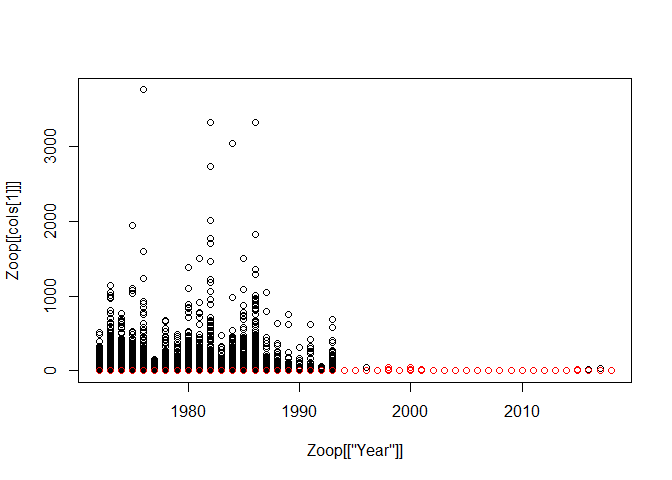
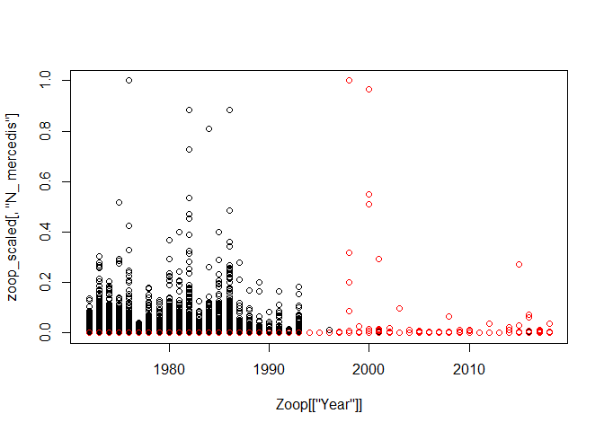
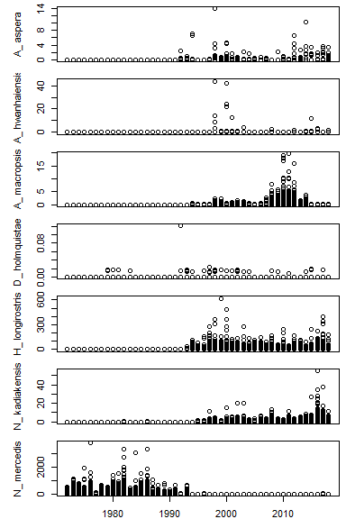

  - [Style Guide](#style-guide)
  - [Functional Programming](#functional-programming)
  - [Function Call](#function-call)
  - [`for` Loop](#for-loop)
  - [`<_>apply` Family Functions](#apply-family-functions)
  - [`lapply` Inner Workings](#lapply-inner-workings)
  - [`lapply` First Example](#lapply-first-example)
  - [Vectorized](#vectorized)
  - [`lapply` On List](#lapply-on-list)
  - [`vapply` Inner Workings](#vapply-inner-workings)
  - [`vapply` Example](#vapply-example)
  - [More with `vapply`](#more-with-vapply)
  - [List of Functions](#list-of-functions)
  - [Download Data](#download-data)
  - [Check Data](#check-data)
  - [Custom Data Summary](#custom-data-summary)
  - [Clean Data](#clean-data)
  - [Scale Data](#scale-data)
  - [Data Split](#data-split)
  - [Plotting](#plotting)

# Style Guide

Herein, I present some quick points about my style guide. This is by no
means the best approach but one that has worked for me and one I’ve
developed over the years.

PascalCase: function names; dataframes; field headings; file names  
camelCase: function parameters  
lower\_case (with underscore): variables

use `<-` instead of `=` for variable assignment  
most every time function call, hard return after left parentheses  
each line keep to max 80 characters

Below is an example creating a function, and then calling that function.
Note how in the call each function parameter is on its own line. This
allows for easily commenting a parameter to try another argument (see
`speciesName`).

    # create function
    LengthFrequency <- function(data, speciesName, forkLength) {
      # do something here
    }
    # end LengthFrequency
    
    len_freq <- LengthFrequency(
      data = Sturgeon,
      speciesName = "white",
      # speciesName = "green",
      forkLength = TRUE
    )

# Functional Programming

`R` is a functional programming language. As such, it has certain
characteristics that can work to one’s advantage.

  - everything is a function call
  - arguments can be other functions
  - functions can return functions

# Function Call

Here, we use `iris`, the built-in dataframe in `datasets` package. Below
demonstrates the ‘everything is a function call’ aspect. Commented
sections display the much more common use.

``` r
`+`(9, 8)                      # 9 + 8
```

    ## [1] 17

``` r
`<-`(x, 1:10)                  # x <- 1:10 or x = 1:10
print(x)
```

    ##  [1]  1  2  3  4  5  6  7  8  9 10

``` r
`==`(9, 8)                     # 9 == 8
```

    ## [1] FALSE

``` r
`[`(iris, 1, 2)                # iris[1, 2]
```

    ## [1] 3.5

``` r
`[[`(iris, 1, 2)               # iris[[1, 2]]
```

    ## [1] 3.5

``` r
`[[`(iris, 1, "Sepal.Width")   # iris[[1, "Sepal.Width"]]
```

    ## [1] 3.5

``` r
# Not run --------------------------------------------------
# `[`(iris, 5)                 # iris[5]
# `[`(iris, , 5, drop = TRUE)  # iris[, 5, drop = TRUE]
# `[[`(iris, 5)                # iris[[5]]
```

To know the what-why-when’s of the `<l|v|m>apply()` family of
`package:base` functions, it helps to understand — at least conceptually
— about a `for` loop. For some items in variable `x`, do something.

# `for` Loop

    for (items in variable) {
      # do something
    }

…an example

``` r
for (i in 1:5) {
  print(i)
}
```

    ## [1] 1
    ## [1] 2
    ## [1] 3
    ## [1] 4
    ## [1] 5

# `<_>apply` Family Functions

Here in `lapply` the argument to `FUN` is that ‘do something’ in the
`for` loop. The function passed to `FUN`, will act on every item in the
`list or vector`.

    lapply(list or vector, FUN = function(x) # do something)

# `lapply` Inner Workings

``` r
lapply
```

    ## function (X, FUN, ...) 
    ## {
    ##     FUN <- match.fun(FUN)
    ##     if (!is.vector(X) || is.object(X)) 
    ##         X <- as.list(X)
    ##     .Internal(lapply(X, FUN))
    ## }
    ## <bytecode: 0x0000000018d7e438>
    ## <environment: namespace:base>

# `lapply` First Example

Here we supply the vector 1–\>5. We wish to add 5 to each number in that
vector.

``` r
lapply(1:5, FUN = `+`, 5)
```

    ## [[1]]
    ## [1] 6
    ## 
    ## [[2]]
    ## [1] 7
    ## 
    ## [[3]]
    ## [1] 8
    ## 
    ## [[4]]
    ## [1] 9
    ## 
    ## [[5]]
    ## [1] 10

# Vectorized

But because R is vectorized, we can simply write below. The results
remain neatly in a vector.

``` r
1:5 + 5
```

    ## [1]  6  7  8  9 10

# `lapply` On List

But what if instead of a vector, we had a **list** of vectors? (an
uneven list in this case)

``` r
X <- list(
  Item1 = 1:5,
  Item2 = 6:10,
  Item3 = 11:20
)

X
```

    ## $Item1
    ## [1] 1 2 3 4 5
    ## 
    ## $Item2
    ## [1]  6  7  8  9 10
    ## 
    ## $Item3
    ##  [1] 11 12 13 14 15 16 17 18 19 20

because `X` is a list, vectorization concept doesn’t work…

``` r
X + 5
# Error in X + 5 : non-numeric argument to binary operator
```

so, here’s where `lapply` is useful. (Adding `5` may not be of
particular importance, but what about squaring each value?)

``` r
lapply(X, FUN = `+`, 5)
```

    ## $Item1
    ## [1]  6  7  8  9 10
    ## 
    ## $Item2
    ## [1] 11 12 13 14 15
    ## 
    ## $Item3
    ##  [1] 16 17 18 19 20 21 22 23 24 25

``` r
lapply(X, FUN = `^`, 2)
```

    ## $Item1
    ## [1]  1  4  9 16 25
    ## 
    ## $Item2
    ## [1]  36  49  64  81 100
    ## 
    ## $Item3
    ##  [1] 121 144 169 196 225 256 289 324 361 400

We can certainly supply a built-in function to `FUN`. Sometimes it is
useful to get count for each item in list.

``` r
lapply(X, FUN = length)
```

    ## $Item1
    ## [1] 5
    ## 
    ## $Item2
    ## [1] 5
    ## 
    ## $Item3
    ## [1] 10

# `vapply` Inner Workings

`vapply` is quite similar to `lapply` but includes some extra (and
convenient) parameters.

``` r
vapply
```

    ## function (X, FUN, FUN.VALUE, ..., USE.NAMES = TRUE) 
    ## {
    ##     FUN <- match.fun(FUN)
    ##     if (!is.vector(X) || is.object(X)) 
    ##         X <- as.list(X)
    ##     .Internal(vapply(X, FUN, FUN.VALUE, USE.NAMES))
    ## }
    ## <bytecode: 0x0000000018d659b0>
    ## <environment: namespace:base>

# `vapply` Example

We can tell `vapply` the expected output of `FUN`. We know
`base::length()` returns a single numeric value, so we can supply just
that to `FUN.VALUE`. *Note*: the `L` maintains 1 as an integer value,
not a double.)

``` r
vapply(X, FUN = length, FUN.VALUE = numeric(1L))
```

    ## Item1 Item2 Item3 
    ##     5     5    10

Now experiment with changing argument to `FUN` or setting `USE.NAMES =
FALSE`.

# More with `vapply`

Here we have a fake employee list. We don’t have a last name for
employee 5.

``` r
employees <- list(
  c("first", "last"),
  c("first", "last"),
  c("first", "last"),
  c("first", "last"),
  c("first")
)

employees
```

    ## [[1]]
    ## [1] "first" "last" 
    ## 
    ## [[2]]
    ## [1] "first" "last" 
    ## 
    ## [[3]]
    ## [1] "first" "last" 
    ## 
    ## [[4]]
    ## [1] "first" "last" 
    ## 
    ## [[5]]
    ## [1] "first"

Can we get employees’ first name or concatenate `first` & `last`…again,
remember that *everything* is a function call. Thus supplying `[` to
`FUN` works. The `1` indicates the element number we wish to index.

``` r
vapply(employees, FUN = `[`, FUN.VALUE = character(1L), 1)
```

    ## [1] "first" "first" "first" "first" "first"

``` r
vapply(employees, FUN = paste0, FUN.VALUE = character(1L), collapse = " ")
```

    ## [1] "first last" "first last" "first last" "first last" "first"

Let’s display our numeric list again.

``` r
# display list `X` again for convenience
X
```

    ## $Item1
    ## [1] 1 2 3 4 5
    ## 
    ## $Item2
    ## [1]  6  7  8  9 10
    ## 
    ## $Item3
    ##  [1] 11 12 13 14 15 16 17 18 19 20

…what if we wanted some descriptive stats for each item in `X`

  - how might you handle `NAs`?
  - how might you change output’s orientation (i.e., stat names as
    columns)?

<!-- end list -->

``` r
vapply(X, FUN = function(x) {
  c(Min = min(x), Max = max(x), Mean = mean(x))
}, FUN.VALUE = numeric(3L))
```

    ##      Item1 Item2 Item3
    ## Min      1     6  11.0
    ## Max      5    10  20.0
    ## Mean     3     8  15.5

same idea, but now we’ve included `N` or count

``` r
vapply(X, FUN = function(x) {
  c(N = length(x), Min = min(x), Max = max(x), Mean = mean(x))
}, FUN.VALUE = numeric(4L))
```

    ##      Item1 Item2 Item3
    ## N        5     5  10.0
    ## Min      1     6  11.0
    ## Max      5    10  20.0
    ## Mean     3     8  15.5

probably the preferred orientation

``` r
t(vapply(X, FUN = function(x) {
  c(N = length(x), Min = min(x), Max = max(x), Mean = mean(x))
}, FUN.VALUE = numeric(4L)))
```

    ##        N Min Max Mean
    ## Item1  5   1   5  3.0
    ## Item2  5   6  10  8.0
    ## Item3 10  11  20 15.5

# List of Functions

We could pass a list of functions as an argument to `vapply`’s `X`.
Though this convention is not as common. *Note*: the last function in
the list is a custom function that returns count of values less than 5.
`x < 5` returns a Boolean, and summing a Boolean returns number `TRUE`,
as `TRUE` = 1, `FALSE` = 0.

``` r
funs <- list(
  Mean = mean,
  Sd = sd,
  N = length,
  NumValsLT5 = function(x) sum(x < 5)
)

vapply(funs, FUN = function(f, nums) {
  f(nums)
}, FUN.VALUE = numeric(1L), nums = 1:10)
```

    ##       Mean         Sd          N NumValsLT5 
    ##    5.50000    3.02765   10.00000    4.00000

# Download Data

Here we use zooplankton data from CDFW’s ftp site.

\*\* note the use of package `readxl` \*\* (install prior to running
below)

``` r
# tempdir()
# list.files(tempdir())

tf <- tempfile(pattern = "thisone", fileext = ".xlsx")

download.file(
  url = "ftp://ftp.wildlife.ca.gov/IEP_Zooplankton/1972-2018MysidMatrix.xlsx",
  # destfile = tempfile(fileext = ".xlsx")
  destfile = tf,
  mode = "ab"
)

# note the space after 2018 in the sheet name --- needed because that space
# exists in the .xlsx file
Zoop <- readxl::read_excel(
  path = tf,
  sheet = "Mysid CPUE Matrix 1972-2018 "
)

# always a good idea to remove (delete) the file after downloading data
unlink(tf)
```

# Check Data

The first thing we want to know about our data is…is it clean? Where are
the NA values (in which fields)? What are field data types? Are these
the correct data types? …

`vapply` can help with this.

In this first example, we check each field in `Zoop` for NA values. The
function will return 0 if no values are NA, and a value \> 0 otherwise.
The value \> 0 indicates the number of NA records in that field.

``` r
vapply(Zoop, FUN = function(x) {
  sum(is.na(x))
}, FUN.VALUE = numeric(1L))
```

    ##         SurveyCode               Year             Survey          SurveyRep 
    ##                  0                  0                  0                  0 
    ##         SampleDate            Station          EZStation         DWRStation 
    ##                  0                  0                  0                  0 
    ##               Core             Region             Secchi              Chl-a 
    ##                  0                  0                 65               3839 
    ##        Temperature    ECSurfacePreTow     ECBottomPreTow        MysidVolume 
    ##                108                219              13751                  0 
    ##          A_ aspera    A_ hwanhaiensis       A_ macropsis     D_ holmquistae 
    ##                  0                  0                  0                  0 
    ##    H_ longirostris     N_ kadiakensis        N_ mercedis Unidentified mysid 
    ##                  0                  0                  0                  0

Here, we include `typeof` to our output. `vapply` no returns a matrix.
*Note*: we use `base::noquote` to remove quotes from the output
(`typeof` returns a character), and `base::t` to transpose the matrix as
two columns instead of two rows.

``` r
t(noquote(vapply(Zoop, FUN = function(x) {
  c(NumNA = sum(is.na(x)), TypeOf = typeof(x))
}, FUN.VALUE = character(2L))))
```

    ##                    NumNA TypeOf   
    ## SurveyCode         0     double   
    ## Year               0     double   
    ## Survey             0     double   
    ## SurveyRep          0     double   
    ## SampleDate         0     double   
    ## Station            0     character
    ## EZStation          0     character
    ## DWRStation         0     character
    ## Core               0     double   
    ## Region             0     character
    ## Secchi             65    double   
    ## Chl-a              3839  logical  
    ## Temperature        108   double   
    ## ECSurfacePreTow    219   double   
    ## ECBottomPreTow     13751 logical  
    ## MysidVolume        0     double   
    ## A_ aspera          0     double   
    ## A_ hwanhaiensis    0     double   
    ## A_ macropsis       0     double   
    ## D_ holmquistae     0     double   
    ## H_ longirostris    0     double   
    ## N_ kadiakensis     0     double   
    ## N_ mercedis        0     double   
    ## Unidentified mysid 0     double

# Custom Data Summary

Of course, using `utils::str` or `base::summary` on new data is always a
good idea. Here, though, we can customize our summary, if you will. For
each field in `Zoop`, if value is a double, return the range. Otherwise,
return frequency table.

(**warning**: long output)

``` r
lapply(Zoop, FUN = function(x) {
  if (is.double(x)) return(range(x, na.rm = TRUE))
  table(x, useNA = "ifany", dnn = NULL)
})
```

    ## $SurveyCode
    ## [1] 19720101 20181201
    ## 
    ## $Year
    ## [1] 1972 2018
    ## 
    ## $Survey
    ## [1]  1 12
    ## 
    ## $SurveyRep
    ## [1] 1 2
    ## 
    ## $SampleDate
    ## [1] "1972-01-10 UTC" "2018-12-19 UTC"
    ## 
    ## $Station
    ##    NZ002    NZ003    NZ004    NZ005    NZ020    NZ022    NZ024    NZ028 
    ##      131       91      157       92      371      367      372      659 
    ##    NZ030    NZ032    NZ033    NZ034    NZ036    NZ038    NZ040    NZ042 
    ##      227      660       96      193      226      217      356      365 
    ##    NZ044    NZ046    NZ048    NZ050    NZ052    NZ054    NZ056    NZ058 
    ##      367      365      663      368      369      653      363      363 
    ##    NZ060    NZ062    NZ064    NZ066    NZ068    NZ069    NZ070    NZ071 
    ##      652      365      654      361      378       15       79       35 
    ##    NZ072    NZ074    NZ076    NZ078    NZ080    NZ082    NZ084    NZ086 
    ##      360      635      360      359      369      360      352      651 
    ##    NZ088    NZ090    NZ092    NZ098    NZ099    NZ100    NZ101    NZ103 
    ##      348      349      642      342       19       18       11        8 
    ##    NZ104    NZ155    NZ161    NZ165    NZ169    NZ295    NZ300    NZ305 
    ##      216       21        4       14        3       12       22       28 
    ##    NZ310    NZ325    NZ338    NZ340    NZ41A    NZC03    NZC09    NZC13 
    ##        4       91       58        4      176      287      305        8 
    ##    NZD06    NZD11    NZD14    NZD15    NZD16    NZD19    NZD28    NZD41 
    ##      295      215      215      363      298      507      632      248 
    ##    NZEZ2 NZEZ2SJR    NZEZ6 NZEZ6SJR    NZM01    NZM02    NZM03    NZM04 
    ##      229       19      208       11       14       16      143       16 
    ##    NZM06    NZM07    NZM08    NZM09    NZM10    NZP02    NZP04    NZP10 
    ##      151      288       15       14      588      150        8        8 
    ##    NZS42 
    ##      612 
    ## 
    ## $EZStation
    ##           NA        NZEZ2        NZEZ6 NZEZ6/NEZEZ2 
    ##        21756          286          286            1 
    ## 
    ## $DWRStation
    ##    D10    D12    D16    D19    D22    D26   D28A     D4    D41   D41A     D6 
    ##    653    635    298    507    654    651    632    652    248    176    295 
    ##     D7     D8    EZ2 EZ2SJR    EZ6 EZ6SJR  MD10A     NA  NZ002  NZ004  NZ032 
    ##    659    663    229     19    208     11    588  11880    131    157    660 
    ##  NZ068  NZ325  NZS42     P8 
    ##    378     91    612    642 
    ## 
    ## $Core
    ## [1] 0 2
    ## 
    ## $Region
    ## CarStrait   EastDel        EZ     NapaR     NEDel    NorDel      SacR       SJR 
    ##       824      1593       467         4       455       743      1487      4901 
    ##     SoDel     SPBay    SuiBay    SuiMar   WestDel 
    ##      1810       581      5945      1561      1958 
    ## 
    ## $Secchi
    ## [1]   4 392
    ## 
    ## $`Chl-a`
    ## FALSE  TRUE  <NA> 
    ##  1429 17061  3839 
    ## 
    ## $Temperature
    ## [1]  4.3 28.4
    ## 
    ## $ECSurfacePreTow
    ## [1]    30 48067
    ## 
    ## $ECBottomPreTow
    ##  TRUE  <NA> 
    ##  8578 13751 
    ## 
    ## $MysidVolume
    ## [1]   2.155777 128.253293
    ## 
    ## $`A_ aspera`
    ## [1]  0.00000 13.82348
    ## 
    ## $`A_ hwanhaiensis`
    ## [1]  0.00000 43.78291
    ## 
    ## $`A_ macropsis`
    ## [1]  0.00000 19.83732
    ## 
    ## $`D_ holmquistae`
    ## [1] 0.0000000 0.1208502
    ## 
    ## $`H_ longirostris`
    ## [1]   0.0000 619.8671
    ## 
    ## $`N_ kadiakensis`
    ## [1]  0.00000 55.25975
    ## 
    ## $`N_ mercedis`
    ## [1]    0.000 3760.078
    ## 
    ## $`Unidentified mysid`
    ## [1]  0.00000 23.88731

We notice something interesting about fields `EZStation` and
`DWRStation`. We have some quoted NAs. That is, entries in the Excel
file are `NA`, not just blank (which would be read by R as NA). This
certainly poses a problem for data summary and other analytics.

``` r
vapply(Zoop, FUN = function(x) {
  sum(x %in% "NA")
}, FUN.VALUE = numeric(1L))
```

    ##         SurveyCode               Year             Survey          SurveyRep 
    ##                  0                  0                  0                  0 
    ##         SampleDate            Station          EZStation         DWRStation 
    ##                  0                  0              21756              11880 
    ##               Core             Region             Secchi              Chl-a 
    ##                  0                  0                  0                  0 
    ##        Temperature    ECSurfacePreTow     ECBottomPreTow        MysidVolume 
    ##                  0                  0                  0                  0 
    ##          A_ aspera    A_ hwanhaiensis       A_ macropsis     D_ holmquistae 
    ##                  0                  0                  0                  0 
    ##    H_ longirostris     N_ kadiakensis        N_ mercedis Unidentified mysid 
    ##                  0                  0                  0                  0

# Clean Data

So how do we efficiently replace the quoted (or character) NA with R’s
NA?

1)  `char_nas` returns the number of character NAs in each field
2)  `b` sets to `TRUE` any value \> 0; `head(Zoop[b])` displays n=6 for
    quick viewing
3)  change all character NAs to NA using `lapply`

*Note*: using `Zoop[b]` before assignment `<-` maintains the data.frame
structure. Otherwise, you will get a list.

*Note*: instead of anonymous function, below would be much better suited
as a named function. This would allow for ease of use on other
data.frames

    function(x) {
      x[x %in% "NA"] <- NA
      x
    }

``` r
char_nas <- vapply(Zoop, FUN = function(x) {
  sum(x %in% "NA")
}, FUN.VALUE = numeric(1L), USE.NAMES = FALSE)

b <- char_nas > 0

head(Zoop[b])
```

    ## # A tibble: 6 x 2
    ##   EZStation DWRStation
    ##   <chr>     <chr>     
    ## 1 NA        NA        
    ## 2 NA        NA        
    ## 3 NA        NA        
    ## 4 NA        D7        
    ## 5 NA        NA        
    ## 6 NA        NZ032

``` r
Zoop[b] <- lapply(Zoop[b], FUN = function(x) {
  x[x %in% "NA"] <- NA
  x
})
```

Now let us do a quick recheck. All character `NAs` should be gone, yes?

``` r
vapply(Zoop, FUN = function(x) {
  sum(x %in% "NA")
}, FUN.VALUE = numeric(1L))
```

    ##         SurveyCode               Year             Survey          SurveyRep 
    ##                  0                  0                  0                  0 
    ##         SampleDate            Station          EZStation         DWRStation 
    ##                  0                  0                  0                  0 
    ##               Core             Region             Secchi              Chl-a 
    ##                  0                  0                  0                  0 
    ##        Temperature    ECSurfacePreTow     ECBottomPreTow        MysidVolume 
    ##                  0                  0                  0                  0 
    ##          A_ aspera    A_ hwanhaiensis       A_ macropsis     D_ holmquistae 
    ##                  0                  0                  0                  0 
    ##    H_ longirostris     N_ kadiakensis        N_ mercedis Unidentified mysid 
    ##                  0                  0                  0                  0

# Scale Data

Sometimes we wish to compare variables with markedly different ranges.
Here fields `N_ mercedis` and `A_ hwanhaiensi` fit that bill.

``` r
cols <- c("N_ mercedis", "A_ hwanhaiensis")

vapply(Zoop[cols], FUN = range, FUN.VALUE = numeric(2L))
```

    ##      N_ mercedis A_ hwanhaiensis
    ## [1,]       0.000         0.00000
    ## [2,]    3760.078        43.78291

``` r
# works too
# apply(Zoop[cols], MARGIN = 2, FUN = range)
```

Here we standardize ([min-max
scaling](https://en.wikipedia.org/wiki/Feature_scaling)) the desired
fields dividing each value (minus the minimum value) by the range
difference.

  
}{max(x)-min(x)}")  

``` r
# for vapply output
fv <- nrow(Zoop)

zoop_scaled <- vapply(Zoop[cols], FUN = function(x) {
  (x - min(x)) / (max(x) - min(x))
}, FUN.VALUE = numeric(fv))

# verify range is 0 to 1
apply(zoop_scaled, MARGIN = 2, FUN = range)
```

    ##      N_ mercedis A_ hwanhaiensis
    ## [1,]           0               0
    ## [2,]           1               1

Plotting the raw data compared to the standardized, we get the
following.

``` r
plot(x = Zoop[["Year"]], y = Zoop[[cols[1]]])
points(x = Zoop[["Year"]], y = Zoop[[cols[2]]], col = "red")
```

<!-- -->

``` r
plot(x = Zoop[["Year"]], y = zoop_scaled[, "N_ mercedis"])
points(x = Zoop[["Year"]], y = zoop_scaled[, "A_ hwanhaiensis"], col = "red")
```

<!-- -->

*Note*: standardizing and (or) plotting these data in this manner might
not be visually or statistically appropriate. This is merely for
demonstration purposes.

# Data Split

Sometimes we wish to summarize data by a particular variable or variable
grouping. `stats::aggregate` is always a nice option. Here, though, we
demonstrate `base::split`, which returns a list and thus works nicely
with `<l|v>apply`.

#### Example 1: mean water temperature by year

Here we use `base::with` for convenience (i.e., to limit
`Zoop$Temperature` or `Zoop[["Temperature"]]`). Variable `s` is a list
of temperature values by year. `vapply` takes each element in the list
(i.e., each year) and returns a mean value.

``` r
mean_temp_yr <- with(data = Zoop, expr = {
  
  s <- split(Temperature, f = Year)
  
  vapply(s, FUN = mean, FUN.VALUE = numeric(1L))
  
})

mean_temp_yr
```

    ##     1972     1973     1974     1975     1976     1977     1978     1979 
    ## 16.51521 19.02667 18.50375 17.75411 18.34837 18.54251 18.26354 18.06725 
    ##     1980     1981     1982     1983     1984     1985     1986     1987 
    ## 17.50951       NA 16.81067       NA 18.54249 18.49678 18.65182       NA 
    ##     1988     1989     1990     1991     1992     1993     1994     1995 
    ##       NA       NA 19.78114 18.92453       NA       NA 17.73082       NA 
    ##     1996     1997     1998     1999     2000     2001     2002     2003 
    ##       NA       NA 16.24128       NA       NA 16.46071 16.23911 16.43720 
    ##     2004     2005     2006     2007     2008     2009     2010     2011 
    ## 16.55890 16.33152 16.26682 15.89955 16.57237 16.25567 15.79316 15.53176 
    ##     2012     2013     2014     2015     2016     2017     2018 
    ## 16.50182       NA       NA 17.40739 16.67295 16.32667 16.41717

Note, however, in the output above, we have many `NA`s. We can use the
`...` in `vapply` to pass `na.rm = TRUE` to `base::mean`. Better…

``` r
mean_temp_yr <- with(data = Zoop, expr = {
  
  s <- split(Temperature, f = Year)
  
  vapply(s, FUN = mean, FUN.VALUE = numeric(1L), na.rm = TRUE)
  
})

mean_temp_yr
```

    ##     1972     1973     1974     1975     1976     1977     1978     1979 
    ## 16.51521 19.02667 18.50375 17.75411 18.34837 18.54251 18.26354 18.06725 
    ##     1980     1981     1982     1983     1984     1985     1986     1987 
    ## 17.50951 18.52698 16.81067 17.74898 18.54249 18.49678 18.65182 18.75315 
    ##     1988     1989     1990     1991     1992     1993     1994     1995 
    ## 18.69945 19.36049 19.78114 18.92453 19.99719 18.73059 17.73082 16.72584 
    ##     1996     1997     1998     1999     2000     2001     2002     2003 
    ## 17.06167 17.71517 16.24128 16.36235 16.33235 16.46071 16.23911 16.43720 
    ##     2004     2005     2006     2007     2008     2009     2010     2011 
    ## 16.55890 16.33152 16.26682 15.89955 16.57237 16.25567 15.79316 15.53176 
    ##     2012     2013     2014     2015     2016     2017     2018 
    ## 16.50182 16.20954 17.36540 17.40739 16.67295 16.32667 16.41717

Suppose, however, we wanted more than just mean. Typically, along with
mean we would like some measure of spread (e.g., variance) and some
count (e.g., n).

We can still use `vapply`, but now we’ve replaced `base::mean` with an
anonymous function that includes `mean`. (*Note*: here is where a custom
function comes in very handy.)

The anonymous function is this…

    function(x) {
      nna <- sum(is.na(x))
      x <- Filter(f = Negate(is.na), x = x)
      c(N = length(x), NNA = nna, Mean = mean(x), Var = var(x))
    }

Let us describe each line.

`nna <- sum(is.na(x))` assigns to variable `nna` the count of values
that are `NA`

`x <- Filter(f = Negate(is.na), x = x)` reassigns variable `x` but
without `NA`s (for help run `?Filter` in your R console).

  - `N = length(x)` gives count of values in `x`, less `NA`s

  - `NNA = nna` gives count of values in `x`, **including** `NA`s
    (remember, we removed `NA`s *after* `sum(is.na(x))`)

  - `Mean = mean(x)` returns the mean value of `x` (`na.rm = TRUE` is
    not needed)

  - `Var = var(x)` returns the variance value of `x` (`na.rm = TRUE` is
    not needed)

Finally, using `c()` bundles the output neatly into a numeric vector,
length = 4, thus `FUN.VALUE = numeric(4L)` below. Optionally, a call to
`t` manipulates output such that the *rows* represent year and *columns*
`N`, `NNA`, `Mean`, and `Var`.

``` r
mean_temp_yr <- with(data = Zoop, expr = {
  
  s <- split(Temperature, f = Year)
  
  # t(vapply(s, FUN = function(x, ...) {
  #   c(Mean = mean(x, ...), Sd = sd(x, ...))
  # }, FUN.VALUE = numeric(2L), na.rm = TRUE))
  
  t(vapply(s, FUN = function(x) {
    nna <- sum(is.na(x))
    x <- Filter(f = Negate(is.na), x = x)
    c(N = length(x), NNA = nna, Mean = mean(x), Var = var(x))
  }, FUN.VALUE = numeric(4L)))
  
})

# just for display
str(mean_temp_yr)
```

    ##  num [1:47, 1:4] 815 720 880 754 798 948 927 913 967 949 ...
    ##  - attr(*, "dimnames")=List of 2
    ##   ..$ : chr [1:47] "1972" "1973" "1974" "1975" ...
    ##   ..$ : chr [1:4] "N" "NNA" "Mean" "Var"

``` r
tail(mean_temp_yr)
```

    ##        N NNA     Mean      Var
    ## 2013 217   1 16.20954 23.30225
    ## 2014 226   1 17.36540 19.70632
    ## 2015 218   0 17.40739 17.10444
    ## 2016 227   0 16.67295 20.47296
    ## 2017 234   0 16.32667 23.24687
    ## 2018 226   0 16.41717 18.55341

``` r
dim(mean_temp_yr)
```

    ## [1] 47  4

#### Example 2: mean water temperature by year by month

Now suppose we wanted our output to be by year and month. Same thing
basically, except we pass to `base::split` year & month (extracted from
`SampleDate` using `base::format`). Note, however, the parameter `drop`
to which we pass `FALSE`. This will include levels that did not occur.
For example, no (sampling) data exists for January 1973, yet
`mean_temp_yr_mon` will contain `0, 0, NaN, NA` as output for that
year-month combination.

Experiment with setting `drop = TRUE`. What changes?

``` r
mean_temp_yr_mon <- with(data = Zoop, expr = {
  
  # extract month from Date (as "01", "02", "03", etc.)
  m <- format(SampleDate, format = "%m")
  
  s <- split(Temperature, f = list(Year, m), drop = FALSE) #, sep = "_"
  
  # could be use but gets a little cumbersome
  # t(vapply(s, FUN = function(x, ...) {
  #   c(Mean = mean(x, ...), Sd = sd(x, ...))
  # }, FUN.VALUE = numeric(2L), na.rm = TRUE))
  
  t(vapply(s, FUN = function(x) {
    nna <- sum(is.na(x))
    x <- Filter(f = Negate(is.na), x = x)
    c(N = length(x), NNA = nna, Mean = mean(x), Var = var(x))
  }, FUN.VALUE = numeric(4L)))
  
})

# for display only
dim(mean_temp_yr_mon)
```

    ## [1] 564   4

``` r
dimnames(mean_temp_yr_mon)[[2]]
```

    ## [1] "N"    "NNA"  "Mean" "Var"

``` r
head(dimnames(mean_temp_yr_mon)[[1]], n = 10)
```

    ##  [1] "1972.01" "1973.01" "1974.01" "1975.01" "1976.01" "1977.01" "1978.01"
    ##  [8] "1979.01" "1980.01" "1981.01"

``` r
head(mean_temp_yr_mon)
```

    ##          N NNA     Mean        Var
    ## 1972.01 43   0 6.181395 0.06964563
    ## 1973.01  0   0      NaN         NA
    ## 1974.01  0   0      NaN         NA
    ## 1975.01  0   0      NaN         NA
    ## 1976.01  0   0      NaN         NA
    ## 1977.01 19   0 8.063158 1.99578947

#### Example 3: employing `stats::aggregate`

Here we use the same anonymous function. But now we are using
`aggregate`, which does the `split`ting for us. Again, we want water
temperature mean and variance by year and month. For convenient output,
we set month `as.numeric`.

We call `utils::str` and notice something interesting about the output.
The structure is a `data.frame`, but our function return — assigned to
field `x` — is a matrix. This is not really a problem, but if we want a
“clean” data.frame, we can simply run the following code (see too
output in the next chunk).

    data.frame(
      out[c("Year", "Mon")],
      out[["x"]]
    )

``` r
mean_temp_yr_mon <- with(data = Zoop, expr = {
  
  # extract month from Date (as "01", "02", "03", etc.)
  m <- as.numeric(format(SampleDate, format = "%m"))
  
  out <- aggregate(
    Temperature,
    by = list(Year = Year, Mon = m),
    FUN = function(x) {
      nna <- sum(is.na(x))
      x <- Filter(f = Negate(is.na), x = x)
      c(N = length(x), NNA = nna, Mean = mean(x), Var = var(x))
    }
  )
  
  out
})

str(mean_temp_yr_mon)
```

    ## 'data.frame':    519 obs. of  3 variables:
    ##  $ Year: num  1972 1977 1978 1979 1980 ...
    ##  $ Mon : num  1 1 1 1 1 1 1 1 1 1 ...
    ##  $ x   : num [1:519, 1:4] 43 19 16 15 21 31 25 25 16 15 ...
    ##   ..- attr(*, "dimnames")=List of 2
    ##   .. ..$ : NULL
    ##   .. ..$ : chr  "N" "NNA" "Mean" "Var"

``` r
mean_temp_yr_mon <- with(data = Zoop, expr = {
  
  # extract month from Date (as "01", "02", "03", etc.)
  m <- as.numeric(format(SampleDate, format = "%m"))
  
  out <- aggregate(
    Temperature,
    by = list(Year = Year, Mon = m),
    FUN = function(x) {
      nna <- sum(is.na(x))
      x <- Filter(f = Negate(is.na), x = x)
      c(N = length(x), NNA = nna, Mean = mean(x), Var = var(x))
    }
  )
  
  data.frame(
    out[c("Year", "Mon")],
    out[["x"]]
  )
})

str(mean_temp_yr_mon)
```

    ## 'data.frame':    519 obs. of  6 variables:
    ##  $ Year: num  1972 1977 1978 1979 1980 ...
    ##  $ Mon : num  1 1 1 1 1 1 1 1 1 1 ...
    ##  $ N   : num  43 19 16 15 21 31 25 25 16 15 ...
    ##  $ NNA : num  0 0 0 0 0 0 0 0 0 0 ...
    ##  $ Mean: num  6.18 8.06 11.17 8.05 9.12 ...
    ##  $ Var : num  0.06965 1.99579 0.00896 0.13838 0.24062 ...

# Plotting

We can use `vapply` in `plot`ting to loop through select variables. Say
we wanted an annual time series of species CPUE (or whatever the data
are).

We can “cheat” a bit to get species field names from our data. Each
species — less `Unidentified mysid` — begins with a capital letter
followed by an underscore. Using the regular expression `^[A-Z]\\_` and
a call to `base::grepl`, we can select only those names (see `nms`
variable below).

`nms` becomes the variable on which we will loop and will be the `y`
variable in our time series plot. Other function parameters are `d` (our
dataframe) and `xVar` (i.e., the `x` variable in our plot, to which in
this case we set as `"Year"`).

``` r
b <- grepl(pattern = "^[A-Z]\\_", x = colnames(Zoop))
nms <- colnames(Zoop)[b]
nms
```

    ## [1] "A_ aspera"       "A_ hwanhaiensis" "A_ macropsis"    "D_ holmquistae" 
    ## [5] "H_ longirostris" "N_ kadiakensis"  "N_ mercedis"

``` r
# for creating layout matrix in next chunk
n <- length(nms)
```

The graphic below is not pretty, but you get the idea (and with more
massaging, we could improve the look). Looping through each `y` variable
to create a stacked plot of the same `x` variable. Further, we could
return a value or list from our anonymous function (see example
`mean(d[[y]], na.rm = TRUE)`).

``` r
# note: chunk runs a bit slowly as we are plotting *all* data points

# construct the layout for stacked plots (i.e., one column)
par(mar = c(1, 4, 0.5, 0.1), oma = c(1, 1, 0.1, 0.5))
layout(mat = matrix(data = seq_len(n), nrow = n, ncol = 1))

vapply(nms, FUN = function(y, d, xVar) {
  
  plot(x = d[[xVar]], y = d[[y]], xlab = xVar, ylab = y, xaxt = "n")
  
  mean(d[[y]], na.rm = TRUE)
  
}, FUN.VALUE = numeric(1L), d = Zoop, xVar = "Year")
```

    ##       A_ aspera A_ hwanhaiensis    A_ macropsis  D_ holmquistae H_ longirostris 
    ##    7.601207e-03    9.766102e-03    3.055391e-02    2.929429e-05    1.675402e+00 
    ##  N_ kadiakensis     N_ mercedis 
    ##    8.425211e-02    2.609872e+01

``` r
# puts tick labels on bottom-most plot as we removed such labels with xaxt = "n"
axis(side = 1, at = axTicks(side = 1), labels = axTicks(side = 1))
```

<!-- -->

Same principle below but not run.

``` r
par(mfrow = c(4, 2))

vapply(nms, FUN = function(y, d, xVar) {
  
  plot(x = d[[xVar]], y = d[[y]], xlab = xVar, ylab = y)
  
  mean(d[[y]], na.rm = TRUE)
  
}, FUN.VALUE = numeric(1L), d = Zoop, xVar = "Secchi")
```

-----

run: March 04 2020 @ 1438  
© IEP educational series
