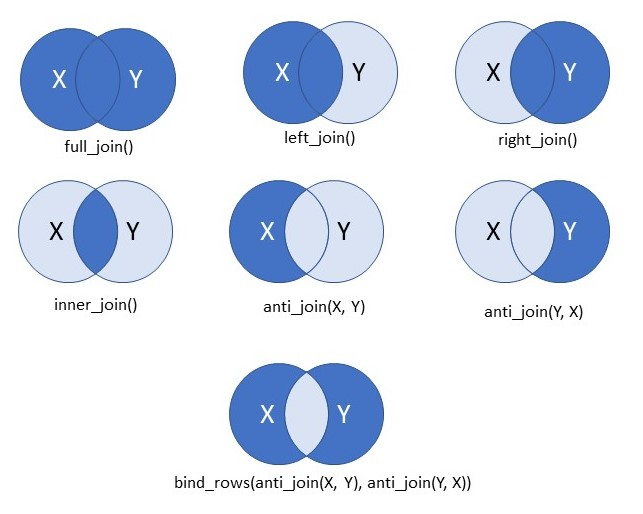

```{r include=FALSE}
library(tidyverse)
#source the data manipulation file if it wasn't run just before this
library(knitr)
knitr::opts_chunk$set(eval = F)
#purl("Data manipulation/data mainpulation.Rmd", output="Data manipulation/datamaip.R")
#source("Data manipulation/datamaip.R")

```


# Dataset Restructuring

## Wide to long

The data is never in the format you want it. Usually, R likes things to be in "long" format instead of "wide" format. However, data is often published in "wide" format, and community analyses like things in "wide" format, so you need to know how to switch between the two. 


You can easily transpose the rows and columns of a matrix using `t`

```{r vapply-matrix_out3} 

#we can set up a quick data frame
X <- data.frame(
  Item1 = 1:5,
  Item2 = 6:10,
  Item3 = 11:20
)

X

#Then Transpose it
Y = t(X)
Y

```


However, sometimes you want to transpose some of the columns and leave the other columns the way they are. For example, we want to keep the environmental data for each row in the zooplankton data set, but transpose the species names.

The functions "pivot_wider" and "pivot_longer" are probably the easiest way to do this.


```{r}
library(tidyverse)
?pivot_longer

CBlong = pivot_longer(CBdata2, #specify the data set you want to pivot
                      cols = ACARTELA:CRABZOEA, #specify the coloms to pivot
                      names_to = "TaxonCode", #give the name of the new column you want to create
                      values_to = "CPUE" #name of the column for the values
                      )

View(CBlong)

```


If we want to put it back in "wide" format, we use "pivot_wider"


```{r}
?pivot_wider

CBwide = pivot_wider(CBlong, #specify the data set you want to pivot
                      id_cols = c(Survey, Year, Date, Station), #Identifier columns (ones you don't want to pivot)
                      names_from = TaxonCode, #give the name of the new column you want to use for the names of the new columns
                      values_from = CPUE #name of the column for the values
                      )

View(CBwide)
```

We can also use this to summarize values as we pivot. For example, if we wanted one row for each year instead of foreach sample, we can do that.


```{r}

CBwideY = pivot_wider(CBlong, #specify the data set you want to pivot
                      id_cols = Year, #specify the column with the unique identifier
                      names_from = TaxonCode, #give the name of the new column you want to use for the names of the new columns
                      values_from = CPUE, #name of the column for the values
                      values_fn = list(CPUE = sum) #function to use to combine values
                      )

View(CBwideY)

```


## Merging data

Frequently, we also need to combine several tables. For example, we might want the GPS coordinates for the stations to be included in our zooplankton table. The excel file had those coordinates, but they were in another spread sheet. To put those tables together, we can use the "merge" function.


```{r}

#first let's import the station lookup table from the excel file

taxalookup <- read_excel("1972-2018CBMatrix.xlsx", 
    sheet = "CB Taxa Lookup")
View(taxalookup)

#apparently the first row wasn't the column names! Oh no!

#let's rename that
names(taxalookup) =  c("TaxonCode", "TaxonName", "StartYear", "EndYear")
View(taxalookup)

#get rid of the first and last row
taxalookup = taxalookup[-c(1,58),]
View(taxalookup)

```


Now we can attach the scientific names to the main "CBlong" data frame


```{r}

?merge

CBlong2 = merge(CBlong, taxalookup, by = "TaxonCode")


```


This automatically only keeps rows that are present in both data sets (equivelent to an "inner join" in SQL). If we want to do a left join or a right joing you can set "all.x = T" or "all.y = T".


```{r}
#for example, if we only had scientific names for some of our taxa
taxalookupshort = taxalookup[1:20,]

CBlong3 = merge(CBlong, taxalookupshort, by = "TaxonCode")
nrow(CBlong)
nrow(CBlong3)
#all the rows that weren't in the first 20 taxa have been dropped


CBlong4 = merge(CBlong, taxalookupshort, by = "TaxonCode", all.x = T)
nrow(CBlong4)
View(CBlong4)
#Empty values are now "NA"

```


That's how it works in base R. The "tidyverse" has a set of functions for differet types of joins that are very similar to the syntax in SQL or an Access database, so some people find them easier to deal with. 


```{r graphics, fig.align = 'center', echo = F, eval = T}

```

```{r}

?join

#for a basic join, the syntax is simmilar
CBlong2 = inner_join(CBlong, taxalookup, by = "TaxonCode")

#but when things get more complicated, it's a little easier to see what you are doing
taxalookupshort = taxalookup[1:20,]

CBlong3 = inner_join(CBlong, taxalookupshort, by = "TaxonCode")
CBlong4 = left_join(CBlong, taxalookupshort, by = "TaxonCode")
nrow(CBlong)
nrow(CBlong3)
nrow(CBlong4)
View(CBlong4)
#Empty values are now "NA"


```


## Now its your turn

1. Import the "Station_GPS.csv" into your environment and merge the latitude and longitude to the "CBlong" data frame.

2. Convert your new data frame (with lats and longs) back to "wide" format.
