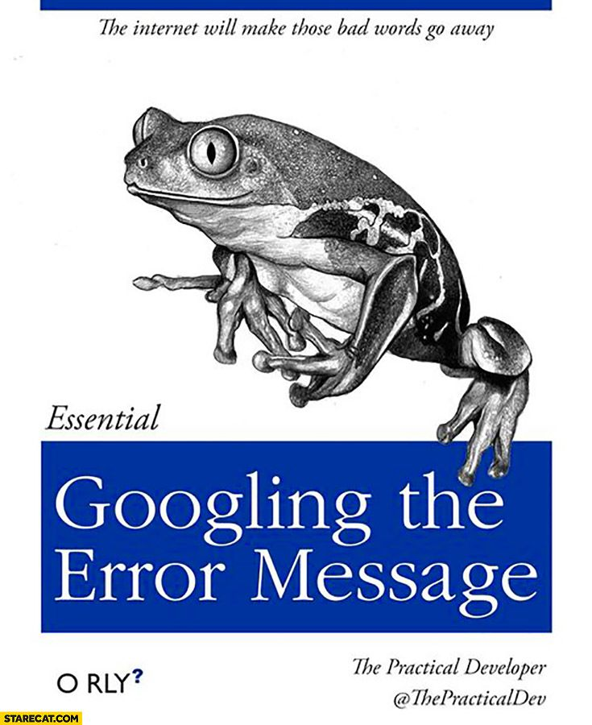
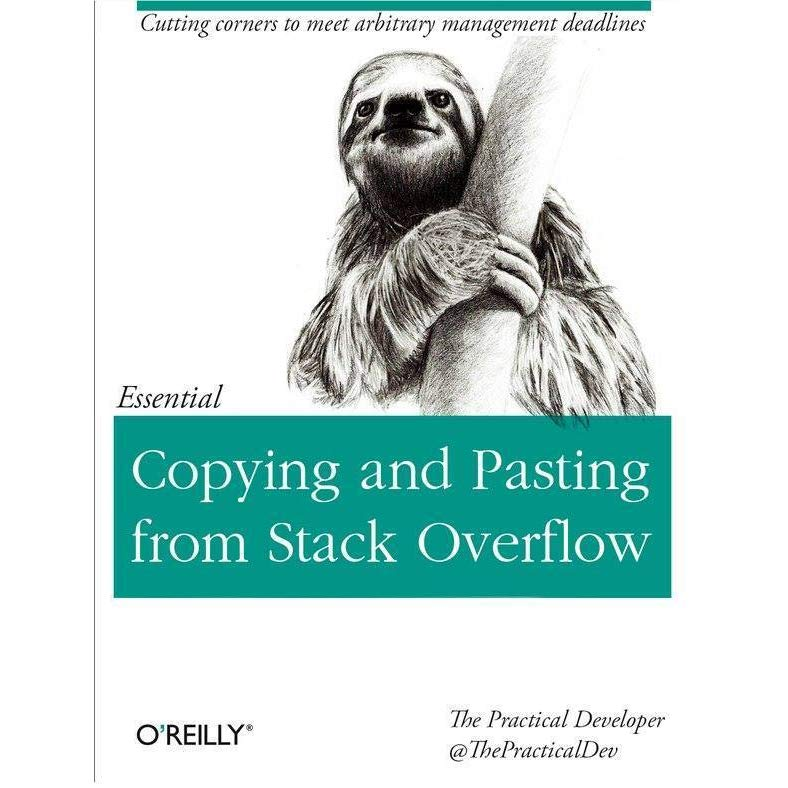

```{r setup, include=FALSE}
knitr::opts_chunk$set(echo = TRUE)
```

## Welcome!

Hi everyone and welcome to the super-fun R learning session of the IEP workshop. R might seem intimidating, but if you keep at it, it's a super-useful skill. 


### R basics


Here we would link to the intro-to-R code


### Data Manipulation

In this class, you will be learning how to download data, restructure it, clean it up, and merge differetn types of data together. We have broaken it into three lessons.

* Part one - downloading data, changing variable formats, changing names

** [Data Manipulation](data-mainpulation.html)

* Part two - transitioning from wide to long format, summarizing data, merging tables

** [Data Restructuring](dataset-restructuring.html)

* Part three - Iterating functions, loops, apply functions, split-apply-combine

** [Iteration tools](applyfunctions.html)


### Graphs

This is where there will be info on graphs


### Other resources

Join the Data Science PWT for more help on these topics! Sign up [here](https://groups.google.com/forum/#!forum/bay-delta-datascience)
or visit us on [GitHub](https://github.com/InteragencyEcologicalProgram/DataScience).

We can list other useful links here too.


# You can do it!

Remember, the difference between being good at coding and being bad at coding it being OK with copying and pasting from Google.

```{r graphics, fig.align = 'center', echo = F, eval = T}


```

